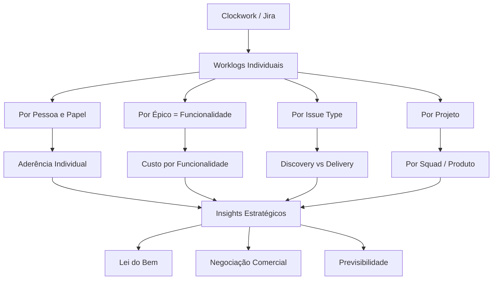

# Projeto POPS — Visão Geral

## Contexto

O Projeto POPS é uma iniciativa de **análise estratégica de dados de horas** registradas no Jira (via Clockwork) para o time de produto da **Omie**. O objetivo é avaliar produtividade, distribuição de esforço e eficiência na execução das atividades.

O projeto surgiu da necessidade de responder perguntas estratégicas sobre custo de desenvolvimento e eficiência do time, com aplicação direta na **Lei do Bem** (benefícios fiscais em P&D) e como ferramenta de **negociação com áreas como Comercial**.

## Pergunta Central

> **Investir mais tempo em Discovery reduz esforço em Delivery?**

## Escopo

A análise considera:
- Diferença entre **horas apontadas vs. horas esperadas** por colaborador
- Atividades **não registradas** (reuniões, alinhamentos, treinamentos) como lacuna natural do modelo
- Padrões de comportamento e consistência no apontamento
- Custo de desenvolvimento por funcionalidade (via **Épicos**)
- Relação entre **Discovery** e **Delivery** (via **Issue Types**)
- Consolidação por **Squad** e **Produto** (não individual)

## Objetivos Estratégicos

| # | Pergunta-chave | Área |
|---|----------------|------|
| 1 | Estamos medindo corretamente a produtividade? | Processo |
| 2 | Onde está o maior desperdício de tempo? | Eficiência |
| 3 | Quanto custa uma funcionalidade? | Financeiro |
| 4 | Investimos corretamente entre Discovery e Delivery? | Estratégia |
| 5 | O problema é produtividade ou modelo de apontamento? | Diagnóstico |
| 6 | Quanto custa colocar um produto/funcionalidade no ar? | Negócio |

## Premissas de Produtividade

| Papel | Meta de Aderência | Observação |
|-------|-------------------|------------|
| PMs   | ~40-50% | Muitas reuniões paralelas não vinculadas a funcionalidades |
| PDs   | ~60-70% | Mais próximos do esperado, mas com atividades não registráveis |
| Devs  | ~70-80% | Maioria do tempo vinculado a tarefas |
| QAs   | ~70-80% | Maioria do tempo vinculado a tarefas |

> [!IMPORTANT]
> PMs e PDs possuem **lacuna natural** no apontamento. A discrepância não é erro — é **ponto de partida** para entender o que acontece com o tempo não registrado e se essas atividades são necessárias.

## Stakeholders

| Pessoa | Papel | Relevância |
|--------|-------|-----------|
| **Mariana Rodrigues** | Analista/Coordenadora | Conduz a análise |
| **Camila Diniz** | PM Omie | Fonte de contexto, co-autora |
| **Bia** | Gestora/Diretoria | Decisora — apresentação de resultados |
| **Edu** | Gestão | Solicita análise semanal |
| **Comercial** | Área de negócio | Destino dos dados de custo |

## Fontes de Dados

| Fonte | Ferramenta | Período |
|-------|-----------|---------|
| Horas apontadas por tarefa | Jira (Clockwork) | Semanal + 3-6 meses |
| Horas esperadas por colaborador | Base interna | Por período |
| Funcionalidades (Épicos) | Jira — Breaking Down por Épicos | Contínuo |
| Tipos de atividade | Jira — Issue Types | Contínuo |
| OKRs do time | Planilha POPs | Trimestral |

## Dimensões de Análise

## Dois Horizontes de Análise

| Horizonte | Período | Finalidade | Solicitado por |
|-----------|---------|-----------|----------------|
| **Tático** | Semanal | Acompanhamento de aderência | Edu |
| **Estratégico** | 3-6 meses | Custo por funcionalidade, Discovery/Delivery | Camila/Bia |

> [!NOTE]
> Épicos ficam abertos por 3-6 meses. Análise semanal é insuficiente para avaliar funcionalidades. Ambos os horizontes são necessários.

## Escalabilidade

**Outros times de tecnologia da Omie começarão a usar Jira para registro de horas.** Este projeto serve como piloto cujo modelo pode ser replicado para toda a organização.
