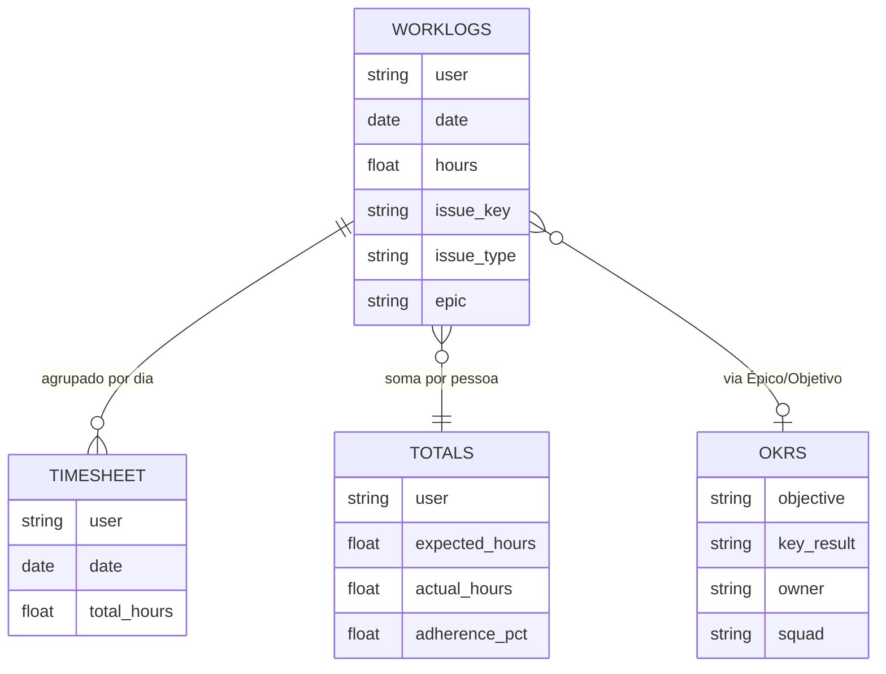

# Dicionário de Dados — Projeto POPS

## Visão Geral das Fontes

Os dados são extraídos do **Jira via Clockwork** (plugin de apontamento de horas) e abrangem o período de **23/03/2026 a 30/03/2026** (8 dias úteis).

| Arquivo | Descrição | Tamanho |
|---------|-----------|---------|
| `timesheet_2026-03-23_2026-03-30.xlsx` | Visão consolidada do timesheet por pessoa/dia | 157 KB |
| `totals_2026-03-23_2026-03-30.xlsx` | Totais agregados (horas esperadas vs apontadas) | 64 KB |
| `worklogs_2026-03-23_2026-03-30.xlsx` | Registros individuais de worklogs (granular) | 1.8 MB |
| `Planejamento de OKRs - POPs.xlsx` | Planejamento de OKRs do time POPs | 986 KB |

---

## Mapeamento de Arquivos

### 1. `timesheet_*.xlsx` — Timesheet Consolidado

**Propósito:** Visão por pessoa e dia, com horas registradas.

**Colunas esperadas (hipótese — validar com profiling):**

| Coluna | Tipo | Descrição |
|--------|------|-----------|
| Usuário / User | string | Nome do colaborador |
| Data / Date | date | Dia do registro |
| Horas Registradas | float | Total de horas apontadas naquele dia |
| Projeto / Project | string | Projeto Jira associado |
| Issue Key | string | Chave da tarefa (ex: POPS-123) |
| Épico / Epic | string | Épico pai da tarefa |

**Relações:** Liga com `worklogs` por Issue Key e com `totals` por Usuário.

### 2. `totals_*.xlsx` — Totais e Aderência

**Propósito:** Comparação entre horas esperadas e apontadas por pessoa.

**Colunas esperadas:**

| Coluna | Tipo | Descrição |
|--------|------|-----------|
| Usuário / User | string | Nome do colaborador |
| Horas Esperadas | float | Total de horas previstas no período |
| Horas Apontadas | float | Total de horas registradas no Jira |
| Diferença / Gap | float | Esperado - Apontado |
| % Aderência | float | Apontado / Esperado × 100 |

**Uso:** Base para análise de aderência e identificação de gaps.

### 3. `worklogs_*.xlsx` — Worklogs Detalhados

**Propósito:** Registro granular de cada apontamento individual.

**Colunas esperadas:**

| Coluna | Tipo | Descrição |
|--------|------|-----------|
| Usuário / User | string | Quem fez o apontamento |
| Data / Date | date | Data do apontamento |
| Horas / Hours | float | Duração registrada |
| Issue Key | string | Tarefa Jira (ex: POPS-456) |
| Issue Type | string | Tipo: Story, Bug, Task, Sub-task |
| Summary | string | Título da tarefa |
| Épico / Epic | string | Épico pai |
| Projeto / Project | string | Projeto Jira |
| Componente | string | Componente técnico (se houver) |
| Descrição do Worklog | string | Comentário do registro |

**Uso:** Base principal — permite análise por tipo de atividade, Discovery vs Delivery, custo por épico.

### 4. `Planejamento de OKRs - POPs.xlsx` — OKRs

**Propósito:** Planejamento estratégico do time com Objetivos e Key Results.

**Colunas esperadas:**

| Coluna | Tipo | Descrição |
|--------|------|-----------|
| Objetivo / Objective | string | O objetivo estratégico |
| Key Result | string | Resultado-chave mensurável |
| Responsável | string | Quem é dono do KR |
| Status | string | Progresso (On track, At risk, etc.) |
| Squad | string | Squad associado |
| Meta / Target | varies | Meta numérica ou textual |
| Progresso / Progress | float | % de conclusão |

**Uso:** Cruza com o esforço em horas para validar se o investimento de tempo reflete as prioridades.

---

## Relações entre Dados

---

## ⚠️ Notas Importantes

> [!CAUTION]
> As colunas acima são **hipóteses** baseadas no padrão Clockwork/Jira. O script `extract_and_explore.py` deve ser executado PRIMEIRO para validar o schema real.

> [!NOTE]
> Campos podem estar em inglês ou português, dependendo da configuração do Jira da Omie.

## Classificação de Tipos para Discovery vs Delivery

Para separar Discovery de Delivery, usar o campo `Issue Type`:

| Categoria | Issue Types |
|-----------|------------|
| **Discovery** | Spike, Research, Prototype, Design, Análise |
| **Delivery** | Story, Task, Sub-task, Development |
| **Qualidade** | Bug, Defeito, Test |
| **Overhead** | Meeting, Administrative, Support |

> Esta classificação deve ser refinada após o profiling dos dados reais.
